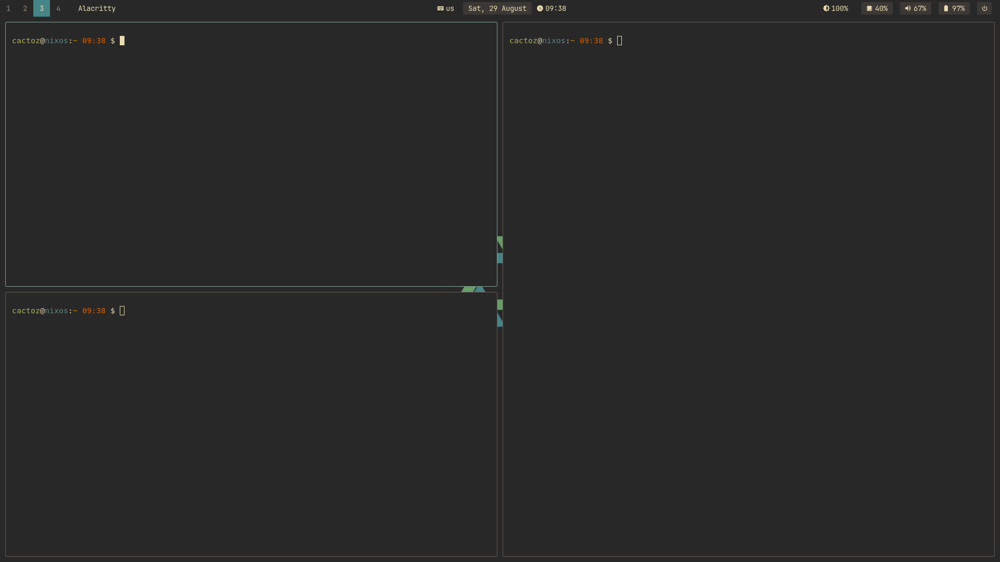
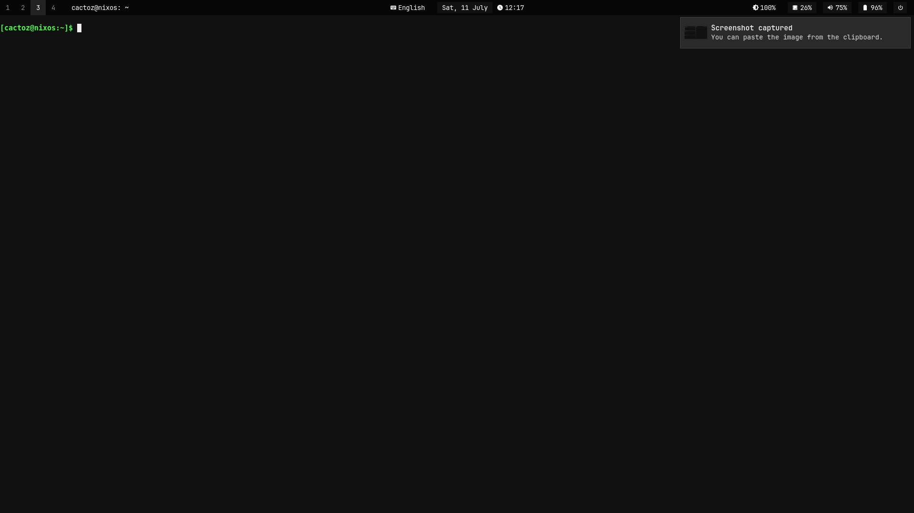
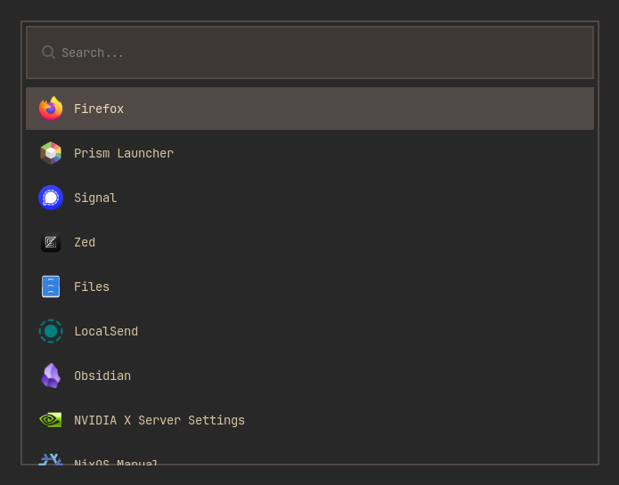

# • cactoz's dotfiles

> Personal configuration files for my NixOS setup

## • Programs

| Name | Task |
| --- | --- |
| NixOS | OS |
| Niri | Window Manager |
| Waybar | Top Bar |
| Wofi | App Launcher |
| SwayNC | Notification Center |
| Helium | Browser |
| Helix + Zed | Code Editor |
| Alacritty | Terminal |
| Bash | Shell |
| cliphist, wl-clipboard | Clipboard Management |

## • Previews

### Terminal

### Wofi

